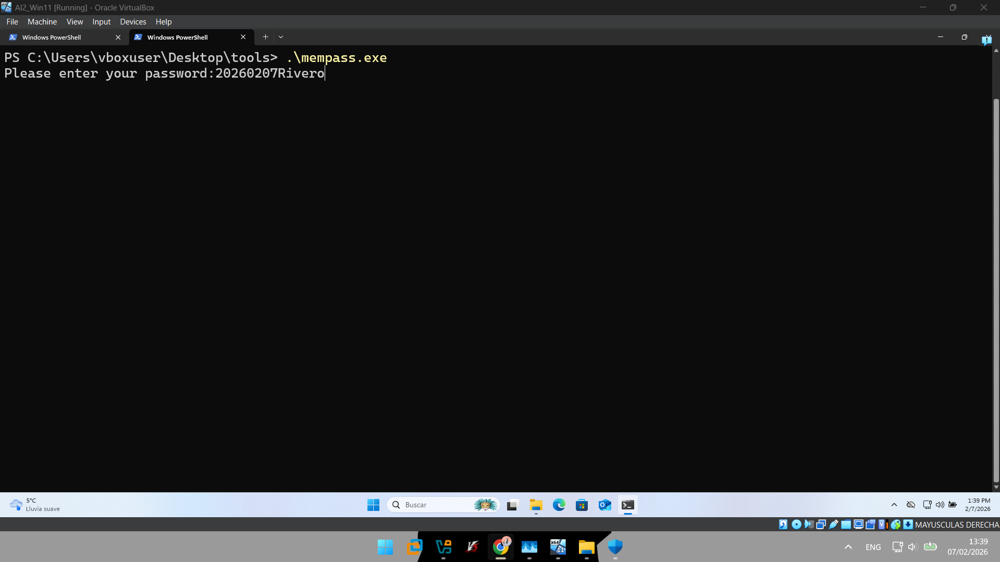
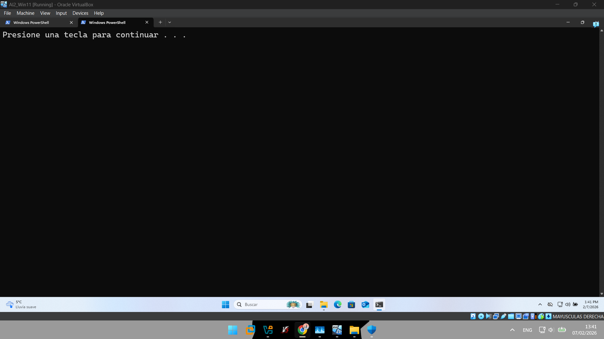
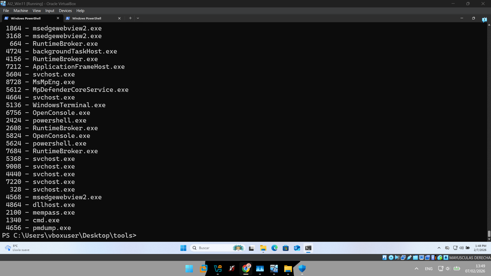
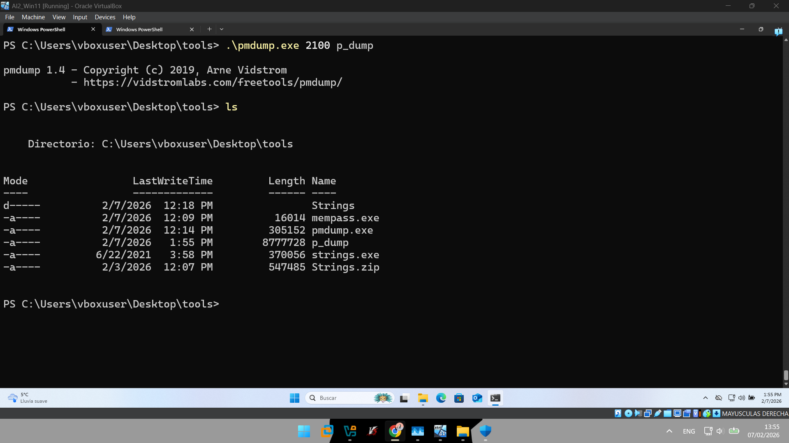
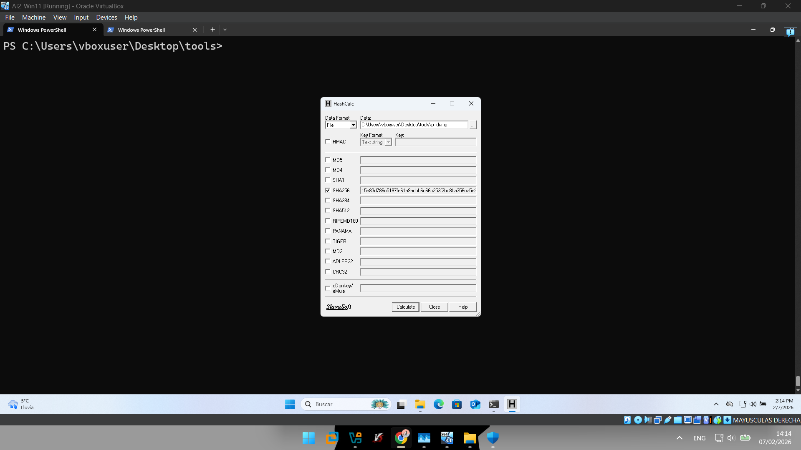
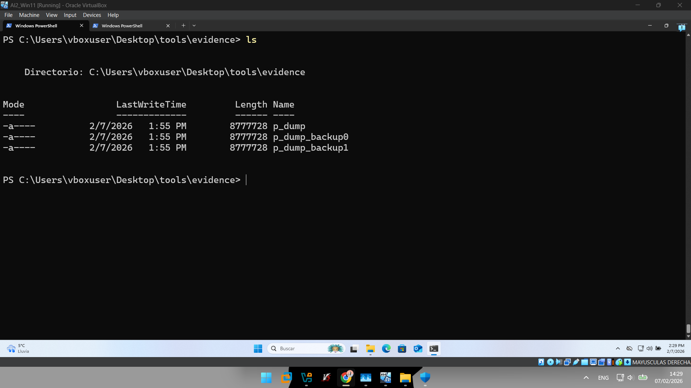
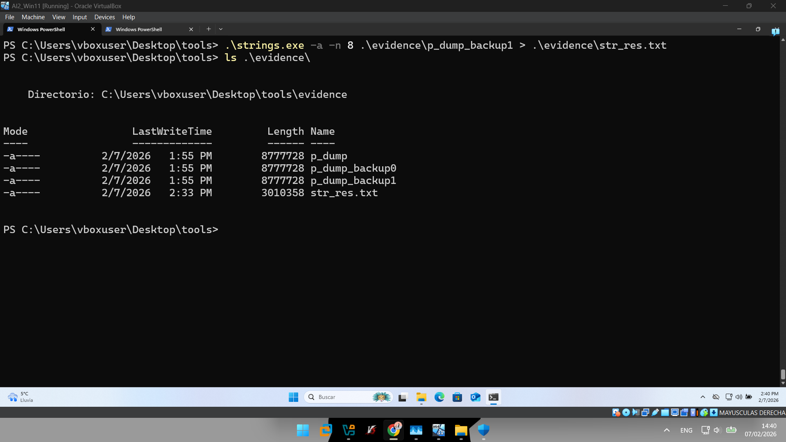
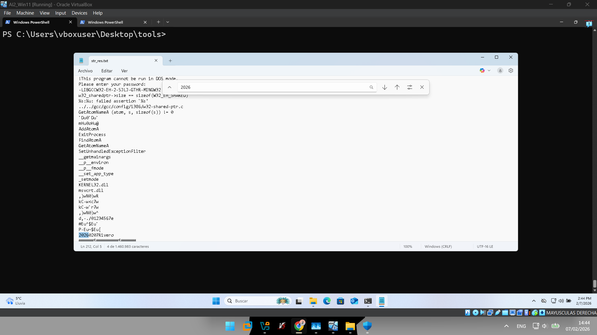

# Informe Pericial 1.1: Volcado y Análisis de Memoria del Proceso MEMPASS
## Tarea 1.1 para la asignatura Auditoría Informática II

**Enlaces**   
[Informe original (PDF)](UNI_1_1.pdf)    
[Archivos adicionales](UNI_1_1.zip)   

**Fecha**   
07/02/2026

---

## Identificación
Caso: Actividad sospechosa en el sistema informático por parte de un usuario   
Código identificador: UNI_1_1   
Responsable del informe: Arturo Rivero Dutra   
Entidad que solicitó el análisis: Universidad Complutense de Madrid   
Persona a la que va dirigido el informe: María Inmaculada Pardines Lence   
Fecha de emisión del informe: 7 de febrero de 2026   

## Antecedentes
La entidad que solicitó el análisis forense descrito en el presente informe detectó actividad sospechosa por parte de un usuario con acceso legítimo al sistema. 

La entidad explica que en su política de generación de contraseñas seguras, todos sus usuarios han de comenzar sus contraseñas con la fecha de creación de dicha contraseña de acuerdo al siguiente formato: YYYYMMDD.  También explica que a principios del presente año, 2026, se forzó a todos los usuarios a actualizar su contraseña a una nueva de acuerdo a la política de seguridad. 

Este informe explica los hallazgos del análisis forense realizado tras un presunto acceso al sistema por parte del usuario. 

## Objetivos
* Adquirir el área de memoria de un proceso. 
* Analizar la información del área de memoria de un proceso. 

## Análisis del Laboratorio Forense
El presente análisis forense ha sido realizado en un laboratorio consistente en una misma Máquina Virtual en la cual se ha generado, adquirido y analizado la evidencia digital. 

**Sistema Operativo (VM):** Windows 11 25H2   
**Nivel de Parcheado/Build:** Build 26200.6584   
**Arquitectura:** x64, 12GB RAM, 30GB Disco   

**Análisis detallado del escenario:**
* Instalación del Sistema Operativo en la máquina virtual completamente limpia. 
* Windows Defender completamente desactivado. 
* Máquina con acceso a internet por ethernet. 

---

## Ciclo de Vida de la Evidencia Digital

### Generación de la Evidencia
Con tal de simular el uso de las credenciales del usuario, se ejecutó el programa mempass.exe, el cual indicaba que se introdujera una contraseña.  Una vez se introdujo la contraseña y se presionó enter, el programa insertó la cadena de texto en su región de memoria correspondiente y procedió a pausarse. 



Se dejó el proceso pausado para mantenerlo en memoria y se abrió una nueva terminal desde donde trabajar. 



### Adquisición de la Evidencia
En esta segunda fase se procedió a identificar el pid del proceso de mempass.exe con el programa pmdump.exe: 

```
> .\pmdump.exe -list
```



Se descubrió que el pid de mempass.exe era 2100.  Una vez se obtuvo esa información, se pudo continuar con el volcado de memoria de ese proceso en concreto obteniendo así la evidencia digital que fue nombrada como p_dump: 

```
> .\pmdump.exe 2100 p_dump
```



Acto seguido, se procedió a realizar el hash SHA-256 de la evidencia obtenida para capturar la integridad de la evidencia original.  Para ello, se empleó el programa HashCalc: 



Obteniendo así el siguiente hash: 

`15e83d786c5197fe61a9adbb6c66c253f2bc8ba356ca5e9e382ce1333734babe` 

Después, con tal de asegurar la calidad en el análisis forense cumpliendo con las buenas prácticas descritas en la ISO/IEC 27037, se procedió a realizar una primera copia de la evidencia bajo el nombre de p_dump_backup0.  Posteriormente se realizó una segunda copia nombrada p_dump_backup1 en la cual fue donde se procedió con el análisis. 



### Análisis de la Evidencia
Se comenzó el análisis haciendo uso de la herramienta strings.exe para parsear el volcado de memoria: 

* **-a:** Para encontrar cadenas ASCII.   
* **-n 8:** Para filtrar por cadenas de longitud de 8 caracteres como mínimo.   
* **str_res.txt:** Nombre del fichero con la salida del programa.   

El comando exacto utilizado fue: 

```
> .\strings.exe -a -n 8 .\evidence\p_dump_backup1 > .\evidence\str_res.txt
```



Por último, se buscó la cadena de texto 2026 dado que el formato de la contraseña contenía la fecha de su creación: 



Así, se reveló la contraseña buscada:   
**20260207Rivero** 

---

## Descripción de la Evidencia Capturada
Relación detallada del elemento capturado: 

| Nombre | Hash SHA-256 | Fecha Adquisición | Analista | Fecha Análisis |
| :--- | :--- | :--- | :--- | :--- |
| p_dump | 15e83d...4babe | 07/02/2026 | Arturo Rivero | 07/02/2026 |

**Anotación:** El análisis se realizó sobre la copia de trabajo p_dump_backup1. 

## Herramientas Utilizadas
* **mempass.exe:** Utilidad para introducir contraseñas en memoria RAM. 
* **pmdump.exe:** Utilidad para realizar volcados de memoria de procesos. 
* **HashCalc:** Herramienta para computar hashes de archivos. 
* **Strings.exe:** Utilidad para buscar cadenas de caracteres en archivos binarios. 

---

## Conclusiones
Como se ha demostrado en el análisis forense, es posible recuperar información sensible como contraseñas de la región de memoria de un proceso.  Esto es vital para capturar evidencias digitales en entornos volátiles antes de que se pierdan por un reinicio o cierre de sesión.  Se han seguido las precauciones adecuadas para su preservación mediante copias de seguridad y verificación de integridad.